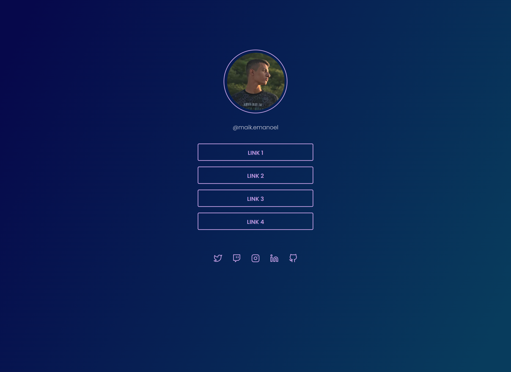

<h1 align="center"> Social Tree </h1>

[Clique aqui para acessar](https://maik-emanoel.github.io/social-tree/)

  <a href="#-tecnologias">Tecnologias</a>&nbsp;&nbsp;&nbsp;|&nbsp;&nbsp;&nbsp;
  <a href="#-projeto">Projeto</a>

## 🚀 Tecnologias

Esse projeto foi desenvolvido com as seguintes tecnologias:

- HTML
- CSS
- JavaScript

## 💻 Projeto

Este é um projeto de uma Social Tree onde o usuário poderá organizar seus links para suas redes sociais, sites e etc. Dessa forma, o usuário poderá colocar o link deste site na sua biografia em alguma rede social, e as pessoas que os segue poderão acessar facilmente as outras redes deste usuário.  

Obs: Projeto construído a partir da área de desafios do Programa Discover da [Rocketseat](https://rocketseat.com.br). Após isso, adicionei novas funcionalidades, como por exemplo: botões com efeitos hover, um novo tema e uma forma dinâmica de adicionar este tema ao site.